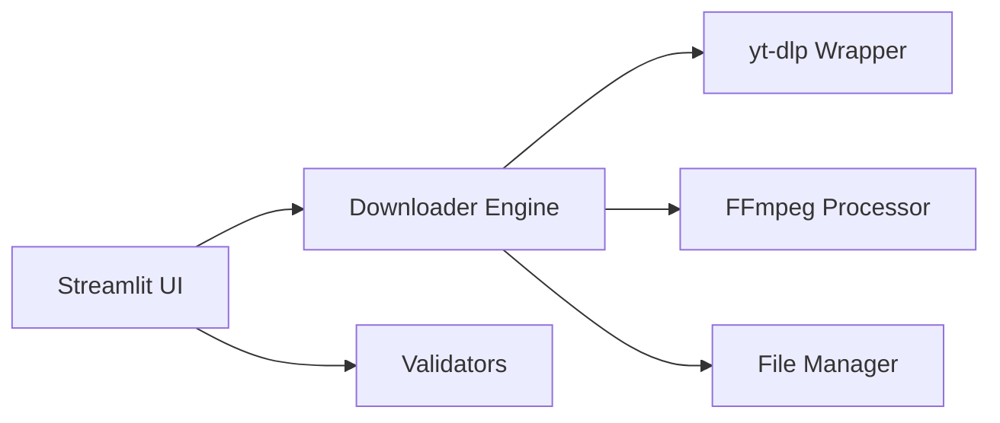

# 🎥 YouTube Downloader (4K & Shorts)
**High-Fidelity Media Extraction Made Simple**

[](https://github.com/google/gemini-cli)
[](https://www.python.org/)
[](https://streamlit.io/)
[](https://opensource.org/licenses/MIT)

**YouTube Downloader** is a streamlined web application for downloading YouTube videos, shorts, and audio with granular control over quality and format, powered by `yt-dlp` and `ffmpeg`.

## 🎬 Visual Preview
High-fidelity breakdown of the **Streamlit Media Hub**:

```mermaid
graph TD
    subgraph Input_Panel [🎥 Media Selection]
        direction LR
        URL[YouTube URL Input] --- Fetch[Fetch Metadata]
    end
    
    subgraph Config_Panel [⚙️ Quality Settings]
        direction LR
        Res[Resolution: 4K/1080p] --- Format[Format: MP4/MP3]
    end

    subgraph Progress_Panel [📊 Real-time Extraction]
        direction LR
        Log[yt-dlp: Streaming...] --- Bar[Progress: [██████░░] 60%]
    end

    Input_Panel --> Config_Panel
    Config_Panel --> Progress_Panel
```

`✅ Verified Media Engine | ✅ Multi-Format Support | ✅ MIT Licensed | ✅ TDD-Verified`

## 🏗 Architecture
The application is built with a clear separation between the UI and the media processing engine.



### Core Components
- **Frontend (`app.py`)**: Manages the Streamlit state, user inputs, and real-time progress visualization.
- **Downloader Engine (`utils/downloader.py`)**: Interfaces with `yt-dlp` to fetch metadata and stream media content.
- **FFmpeg Processor**: Handles post-processing, audio extraction, and quality merging.
- **Validators (`utils/validators.py`)**: Surgical URL verification and format checks.
- **File Manager (`utils/file_manager.py`)**: Manages temporary downloads, naming conventions, and cleanup.

## 🚀 Key Features
- 🎥 **Broad Support**: Download YouTube videos, shorts, and audio-only streams.
- 📊 **Granular Quality**: Choose exact video resolutions and audio formats.
- ⚡ **Real-time Progress**: Live visual tracking of download and processing steps.
- 🛠 **Surgical Validation**: Automated URL verification to prevent failed requests.

## 📦 Getting Started

### Prerequisites
- Python 3.11+
- [ffmpeg](https://ffmpeg.org/) (Installed and in PATH)

### Setup & Run
Using [uv](https://github.com/astral-sh/uv) (Recommended):
```bash
uv sync
uv run streamlit run app.py
```

Standard Pip:
```bash
pip install -r requirements.txt
streamlit run app.py
```

## 🧪 Testing
```bash
pytest -n auto
```

## 📜 License
This project is licensed under the **MIT License** - see the [LICENSE](LICENSE) file for details.

---
*Built with ❤️ for High-Quality Media Extraction.*
