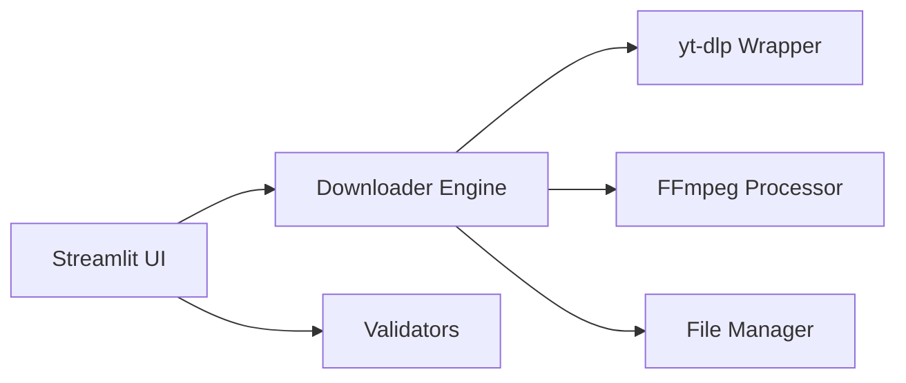

# 🎥 YouTube Downloader (4K & Shorts)
**High-Fidelity Media Extraction Made Simple**

[](https://github.com/google/gemini-cli)
[](https://www.python.org/)
[](https://streamlit.io/)
[](https://opensource.org/licenses/MIT)

**YouTube Downloader** is a streamlined web application for downloading YouTube videos, shorts, and audio with granular control over quality and format, powered by `yt-dlp` and `ffmpeg`.

`✅ Verified Media Engine | ✅ Multi-Format Support | ✅ MIT Licensed | ✅ TDD-Verified`

## ✨ Features
- Download YouTube videos and shorts

## 🏗 Architecture
The application is built with a clear separation between the UI and the media processing engine.



### Core Components
- **Frontend (`app.py`)**: Manages the Streamlit state, user inputs, and real-time progress visualization.
- **Downloader Engine (`utils/downloader.py`)**: Interfaces with `yt-dlp` to fetch metadata and stream media content.
- **FFmpeg Processor**: Handles post-processing, audio extraction, and quality merging.
- **Validators (`utils/validators.py`)**: Surgical URL verification and format checks.
- **File Manager (`utils/file_manager.py`)**: Manages temporary downloads, naming conventions, and cleanup.
- Choose video quality and audio format
- Real-time download progress
- Download as video+audio or audio-only

## Requirements
- Python 3.11+
- [ffmpeg](https://ffmpeg.org/) (must be installed on your system)

## Setup

1. **Clone the repository:**
   ```sh
   git clone <your-repo-url>
   cd YouTubeDownloader-2
   ```
2. **Install Python dependencies:**
   ```sh
   pip install -r requirements.txt
   # or, if using uv/pyproject.toml:
   uv pip install -r requirements.txt
   ```
   Or use the provided `pyproject.toml` with your preferred tool (e.g., `uv`, `pip`, or `poetry`).

3. **Install ffmpeg:**
   - **macOS:** `brew install ffmpeg`
   - **Ubuntu:** `sudo apt-get install ffmpeg`
   - **Windows:** [Download from ffmpeg.org](https://ffmpeg.org/download.html) and add to PATH

4. **Run the app:**
   ```sh
   streamlit run app.py
   ```

## Using [uv](https://github.com/astral-sh/uv) (Recommended for Fast Python Projects)

1. **Initialize the project (if not already initialized):**
   ```sh
   uv init
   ```
   *(Skip this if `pyproject.toml` already exists)*

2. **Install dependencies:**
   ```sh
   uv sync
   ```
   or, if you want to use requirements.txt:
   ```sh
   uv pip install -r requirements.txt
   ```

3. **Run the app:**
   ```sh
   uv run streamlit run app.py
   ```

## Usage
- Enter a YouTube video or shorts URL.
- Click "Get Video Info" to preview details.
- Select download options and click "Start Download".
- When complete, click the download button to save the file.

## Project Structure
- `app.py` — Main Streamlit app
- `utils/` — Helper modules for downloading, file management, and validation
- `pyproject.toml` — Project dependencies
- `.gitignore` — Files and folders to exclude from Git

## Tests
- install requirements from `requirements-dev.txt` and run
```sh
   pytest -n auto
```

## 📜 License
This project is licensed under the **MIT License** - see the [LICENSE](LICENSE) file for details.

---
*Built with ❤️ for High-Quality Media Extraction.*
 