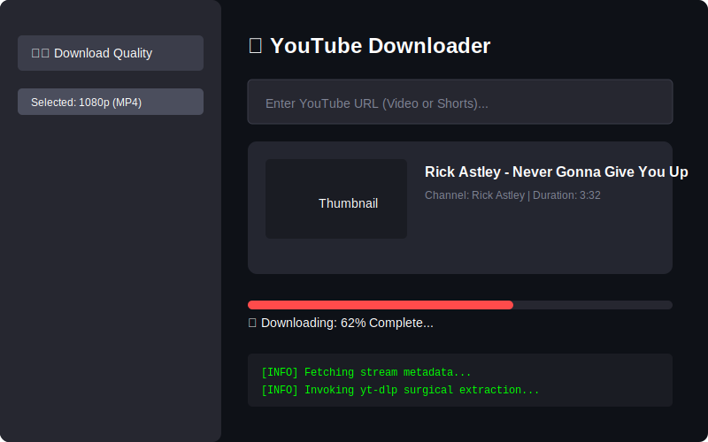
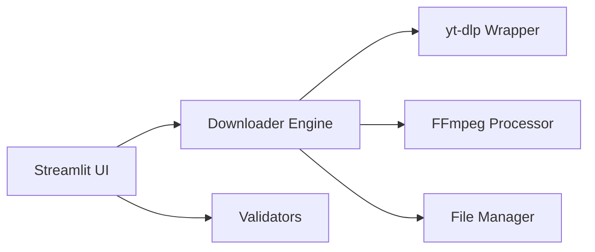

# 🎥 YouTube Downloader (4K & Shorts)
**High-Fidelity Media Extraction Made Simple**

[](https://github.com/google/gemini-cli)
[](https://www.python.org/)
[](https://streamlit.io/)

**YouTube Downloader** is a streamlined web application for downloading YouTube videos, shorts, and audio with granular control over quality and format, powered by `yt-dlp` and `ffmpeg`.

`✅ Verified Media Engine | ✅ Multi-Format Support | ✅ MIT Licensed | ✅ TDD-Verified`

## 🎬 UI Preview


## 🏗 Architecture
The application is built with a clear separation between the UI and the media processing engine.



### Core Components
- **Frontend (`app.py`)**: Manages the Streamlit state, user inputs, and real-time progress visualization.
- **Downloader Engine (`utils/downloader.py`)**: Interfaces with `yt-dlp` to fetch metadata and stream media content.
- **FFmpeg Processor**: Handles post-processing, audio extraction, and quality merging.
- **Validators**: Surgical URL verification and format checks.

## 🚀 Key Features
- 🎥 **Broad Support**: Download YouTube videos, shorts, and audio-only streams.
- 📊 **Granular Quality**: Choose exact video resolutions and audio formats.
- ⚡ **Real-time Progress**: Live visual tracking of download and processing steps.

## 📦 Getting Started
Using [uv](https://github.com/astral-sh/uv) (Recommended):
```bash
uv sync
uv run streamlit run app.py
```

## 📜 License
This project is licensed under the **MIT License** - see the [LICENSE](LICENSE) file for details.

---
*Built with ❤️ for High-Quality Media Extraction.*
